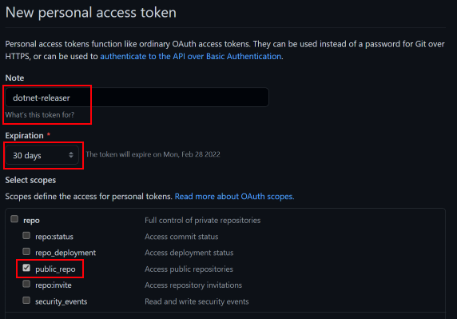

# dotnet-releaser [](https://github.com/xoofx/dotnet-releaser/actions) [](https://www.nuget.org/packages/dotnet-releaser/)


`dotnet-releaser` is a command line tool to easily cross-compile, package and publish your .NET command line application to NuGet and GitHub.

## Features

- **Cross-compile** your .NET application to **9+ OS/CPU targets**.
- Create **zip archives**, **Linux packages** (debian, rpm) and **Homebrew taps**
- Extract **your changelog** from your `changelog.md`
- **Publish all artifacts** to **NuGet** and **GitHub**

## Defaults

By default, `dotnet-releaser` will cross-compile and package automatically the following targets:

- NuGet package (packed as a .NET global tool)
- `[win-x64]` with `[zip]` package            
- `[win-arm]` with `[zip]` package            
- `[win-arm64]` with `[zip]` package          
- `[linux-x64]` with `[deb, tar]` packages    
- `[linux-arm]` with `[deb, tar]` packages    
- `[linux-arm64]` with `[deb, tar]` packages  
- `[rhel-x64]` with `[rpm, tar]` packages     
- `[osx-x64]` with `[tar]` package            
- `[osx-arm64]` with `[tar]` package          

When publishing, `dotnet-releaser` will automatically:

- **Publish your application as a global tool to NuGet**
- **Upload all the package artifacts and your changelog to GitHub** on the tag associated with your package version (e.g your package is `1.0.0`, it will try to find a git tag `v1.0.0` or `1.0.0`).
- **Create a Homebrew repository and formula**  (e.g `user_or_org/homebrew-your-app-name`) for all the tar files associated with the targets for Linux and MacOS.

See the [documentation](https://github.com/xoofx/dotnet-releaser/blob/main/doc/readme.md) on how to setup this differently for your application.
## Getting started

### 1. Install dotnet-releaser

`dotnet-releaser` expects that [.NET 6 SDK](https://dotnet.microsoft.com/en-us/download/dotnet/6.0) is installed.

Then you just need to install it as a global tool. Check the latest version!

```shell
dotnet tool install --global dotnet-releaser --version 0.1.0
```
### 2. Create a TOM configuration file

You need to create a TOML configuration file that will instruct which project to build and package, and to which GitHub repository.

You can use `dotnet-releaser new` to create this configuration file.

Let's create a .NET HelloWorld project:

```shell
dotnet new console --name HelloWorld
```

```shell
cd HelloWorld
dotnet-releaser new --project HelloWorld.csproj
```

This will create a `dotnet-releaser.toml`. Replace the GitHub user/repository associated with the tool. You only need to specify them if you are going to publish to GitHub.

```toml
# configuration file for dotnet-releaser
[msbuild]
project = "HelloWorld.csproj"
[github]
user = "github_user_or_org_here"
repo = "github_repo_here"
```

### 3. Build

You can cross-compile and build all packages by running the sub-command `build`:

```shell
dotnet-releaser build --force dotnet-releaser.toml
```

It will create a sub folder `artifacts-dotnet-releaser` (Don't forget to add it to your `.gitignore`!) that will contain:

```shell
> ls artifacts-dotnet-releaser
HelloWorld.1.0.0.linux-arm.deb        
HelloWorld.1.0.0.linux-arm.tar.gz     
HelloWorld.1.0.0.linux-arm64.deb      
HelloWorld.1.0.0.linux-arm64.tar.gz   
HelloWorld.1.0.0.linux-x64.deb        
HelloWorld.1.0.0.linux-x64.tar.gz     
HelloWorld.1.0.0.nupkg                
HelloWorld.1.0.0.osx-arm64.tar.gz     
HelloWorld.1.0.0.osx-x64.tar.gz       
HelloWorld.1.0.0.rhel-x64.rpm         
HelloWorld.1.0.0.rhel-x64.tar.gz      
HelloWorld.1.0.0.win-arm.zip          
HelloWorld.1.0.0.win-arm64.zip        
HelloWorld.1.0.0.win-x64.zip          
```
### 4. Publish

The `publish` command allows to build and publish all packages to GitHub and NuGet.

```shell
dotnet-releaser publish --force --github-token YOUR_GITHUB_TOKEN_HERE --nuget-token YOUR_NUGET_TOKEN_HERE  dotnet-releaser.toml
```

For GitHub you need to create a [personal access token](https://docs.github.com/en/authentication/keeping-your-account-and-data-secure/creating-a-personal-access-token)

You should tick the `public_repo` in the list:

- [x] public_repo

And put an appropriate expiration date.




## Documentation

For more details and advanced usage, please visit the [documentation](https://github.com/xoofx/dotnet-releaser/blob/main/doc/readme.md).
## License

This software is released under the [BSD-Clause 2 license](https://opensource.org/licenses/BSD-2-Clause). 

## Author

Alexandre Mutel aka [xoofx](http://xoofx.com).